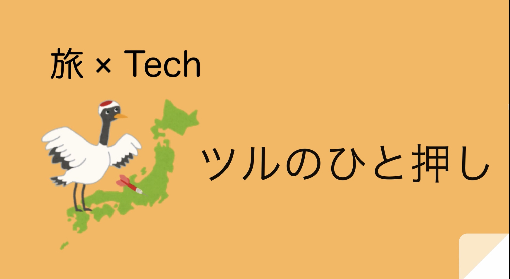

#ツルのひと押し

## 製品概要

### 背景(製品開発のきっかけ、課題等）

一人旅で行き先を決めてない、友達同士で行き先はたくさん出したけど、行き先が複数あって決まらないことがある。そんなときに楽しく行き先を決めたい・決めてほしい。そこでダーツの旅を連想した。

### 製品説明（具体的な製品の説明）

旅先の難易度のモードを選んで、提案してほしい項目を選び、ダーツを投げると、旅先がランダムに提案されます。その結果は、地図で見れたり、SNS でシェアできます。

### 特長

####1.モード分け
旅の玄人をメインターゲットとして、行き先のない旅のときに使ってもらうことを第一に想定しました。もちろん、ビギナーさんも使いやすいように旅先の難易度を調整できるモード分け機能をつけました。

####2.ダーツがスマホの角度に応じて動きます。

####3.提案項目を選べる。

### 解決出来ること

旅先決めのお手伝い・盛り上げ。

### 今後の展望

・提案項目を増やす。
・ダーツ投げ UI・UX の改善。
・エンタメ要素を増やす。

### 注力したこと（こだわり等）

- スマホの向きとダーツの向きの連動
- ダーツを投げたときのアニメーション

## 開発技術

### 活用した技術

#### API・データ

- フロントエンド（html,scss,js,react)

#### フレームワーク・ライブラリ・モジュール

- materialUI
